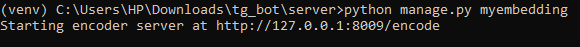
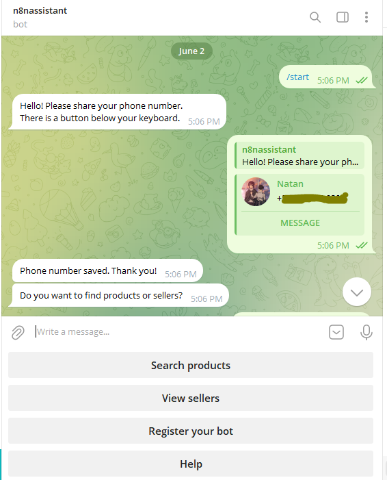

# Telegram AI Bot

 Telegram AI bot built with Django helps users discover and search for products that are posted in group chats.


## Features

- **User Authentication**: Asks for user's contact before proceeding.
- **Group Integration**: Read new posts from groups the bot is added to and update database by generating embeddings and tags for the posts.
- **Smart Search**: Find products using semantic search powered by vector embeddings when user interacts with the bot.
- **Bot Registration**: Register your bot with the botfather and get a token (Running as a platform for other bots)

## Tech Stack

- **Backend**: Django 4.2
- **Database**: PostgreSQL with pgvector extension
- **AI/ML**: Groq and Sentence Transformers for embeddings
- **Telegram Bot**: python-telegram-bot v22.0
- **Vector Database**: pgvector and cosine similarity for querying database.

## Prerequisites
- Groq API Key (for new post embedding generation)
- Telegram Bot Token (from [@BotFather](https://t.me/botfather))

## Installation

1. Clone the repository:
   ```bash
   git clone https://github.com/Natan-Asrat/tg_shopping_bot.git
   cd tg_shopping_bot
   ```

2. Create and activate a virtual environment:
   ```bash
   python -m venv venv
   call venv/Scripts/activate  # CMD
   ```

3. Install dependencies:
   ```bash
   pip install -r requirements.txt
   ```

4. Go into the server directory:
   ```bash
   cd server
   ```

5. Set up environment variables in `.env` file inside the server directory:
   ```
   SECRET_KEY=your_django_secret_key
   DEBUG=true
   TELEGRAM_TOKEN=your_telegram_bot_token
   BOT_USERNAME=your_bot_username
   GROQ_API_KEY=your_groq_api_key
   DB_USER=your_db_user
   DB_PASSWORD=your_db_password
   DB_HOST=your_db_host
   DB_PORT=your_db_port
   DB_NAME=your_db_name
   ENCODER_SERVER_PORT=8009
   ENCODER_SERVER_HOST=127.0.0.1
   ENCODER_SERVER_SCHEME=http
   ```

6. Run database migrations:
   ```bash
   python manage.py migrate
   ```

7. Create a superuser (for admin access):
   ```bash
   python manage.py createsuperuser
   ```

## Running the Bot

1. Start the Django development server:
   ```bash
   python manage.py runserver
   ```

2. In a separate terminal, start the bot:
   ```bash
   python manage.py mybot
   ```
   

3. In a separate terminal, start the encoder server (embeds user query):
   ```bash
   python manage.py myembedding
   ```
   
   
## Usage

1. Create a bot on Telegram and get a token from [@BotFather](https://t.me/botfather)
    
    

2. Set the `TELEGRAM_TOKEN` environment variable to the bot token
    
    

3. Start a chat with the bot on Telegram 
4. Use the `/start` command to begin and provide contact when asked by clicking on the button saying `Share Phone` 
    
    

5. Click on `Register your bot` button from the menu provided
6. Get a bot token from [@BotFather](https://t.me/botfather) and paste the token in the chat where you clicked `Register your bot`
    
    

7. Add the new bot to a group chat and make it an admin
    
    

8. Start conversation with the new bot
    
    

9. Use the `/search` command to search for products in the group (only new posts are read)

    


## Contact
 - LinkedIn: [Natan Asrat](https://linkedin.com/in/natan-asrat)
 - Gmail: nathanyilmaasrat@gmail.com
 - Telegram: [Natan Asrat](https://t.me/fail_your_way_to_success)
 - Youtube: [Natville](https://www.youtube.com/@natvilletutor)
